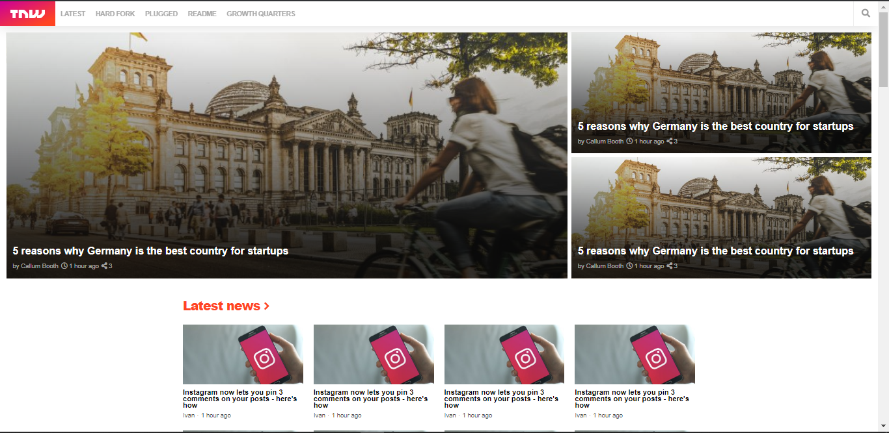

# TNW-clone

This page is a clone of a TNW page made for the Milestone [6] project of Microverse &amp; Odin Project.

This project consists of building an HTML document that matches the appearance of The Next Web page.

## Built With

- HTML, css
- BIM
- 7-1 Pattern
- No frameworks

## Live Demo

[Live Demo Link](https://rawcdn.githack.com/MohameDawood/the-next-web-clone/3d107e8b88aea6abf23959ff01b229ad1d5c5d16/index.html)

## Authors

👤 **Mohamed Dawood**

- Github: [@MohameDawood](https://github.com/MohameDawood/)
- Twitter: [@MohameDawood8](https://twitter.com/Mohamedawood8)
- Linkedin: [MohameDawood](https://www.linkedin.com/in/mohamedawood/)

## 🤝 Contributing

Contributions, issues and feature requests are welcome!

Feel free to check the [issues page](issues/).

## Show your support

Give a ⭐️ if you like this project!

## Acknowledgments

- Thank you in advance

## 📝 License

No licence.
